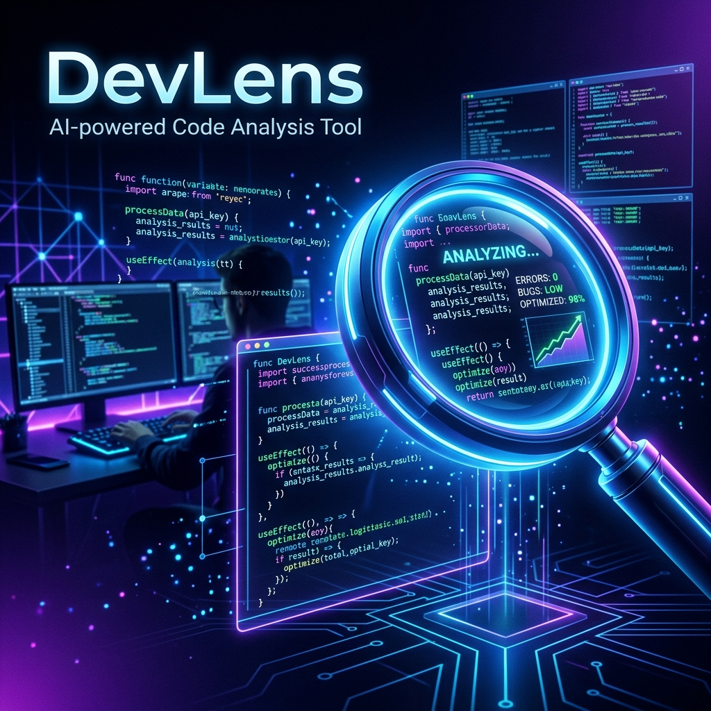

<div align="center">
  
  <br/><br/>
  
  <h1>🔍 DevLens</h1>
  <h3>Turn Code Review & Onboarding from Hours to Seconds</h3>

  <p>
    An AI-powered developer tool that provides instant, senior-level code reviews and comprehensive repository documentation. Built for the <strong>IBM Bob Hackathon 2026</strong>.
  </p>

  [](https://ibm.com/bob)
  [](https://opensource.org/licenses/MIT)
  [](https://nextjs.org/)
  [](https://ai.google.dev/)
  
  <br/>
  
  <strong>[🔴 Live Demo](https://dev-lens-ibm-d0yv1tbg0-anshsurana123s-projects.vercel.app/)</strong> •
  <strong>[📖 Documentation](https://github.com/Anshsurana123/dev-lens-IBM-BOB)</strong> •
  <strong>[🐛 Report Bug](https://github.com/Anshsurana123/dev-lens-IBM-BOB/issues)</strong>

</div>

---

## 🚀 Overview

**DevLens** is a multi-platform AI developer tool suite designed to completely eliminate code review bottlenecks and onboarding friction. By leveraging the blistering speed of **Gemini 2.5 Flash**, DevLens scans code snippets or entire GitHub repositories to provide actionable insights, security audits, and performance reviews in seconds.

Whether you prefer a **No-Install Web Application**, integrated **IDE Slash Commands**, or a **VS Code Extension**, DevLens meets you where you work.

---

## 🎯 The Problem

Modern software development teams face significant friction points:
- **😰 Pre-PR Anxiety**: Developers are unsure if their code meets standards before submitting.
- **⏰ Slow Reviews**: Waiting hours or days for a senior engineer to review a Pull Request.
- **📚 Onboarding Hell**: Spending weeks trying to understand a legacy or complex codebase.
- **🔍 Missing Edge Cases**: Shipping security vulnerabilities or performance bottlenecks due to human oversight.

**The result?** Slower shipping cycles, increased technical debt, and developer burnout.

---

## 💡 The Solution

DevLens acts as an automated, infinitely scalable Senior Engineer. It offers **6 core analysis modes** directly from a beautiful Next.js web interface:

1. 🔍 **Code Review**: Get senior-level PR reviews with risk scores, bug detection, and actionable feedback.
2. 🔒 **Security Audit**: OWASP Top 10 vulnerability scanning with specific fixes and severity ratings.
3. 📖 **Code Explanation**: Understand complex algorithms with plain English explanations.
4. 🧪 **Test Coverage**: Identify untested code and generate ready-to-use Jest/Pytest/JUnit templates.
5. ⚡ **Performance Check**: Find bottlenecks via Big O analysis and optimization suggestions.
6. 🔧 **Refactoring**: Detect code smells and apply SOLID design pattern improvements.

### 📦 Full Repository Scanning
DevLens isn't limited to snippets. Paste **ANY public GitHub repository URL**, and DevLens will automatically fetch the codebase tree, read the files, and generate a comprehensive "Repo Bible" to help you onboard in minutes.

---

## 🛠️ Tech Stack & Architecture

We built DevLens for maximum speed and scalability:

- **Frontend**: Next.js 14 (App Router), React, Tailwind CSS
- **Backend API**: Next.js Serverless Route Handlers
- **AI Engine**: Google Gemini 2.5 Flash (Optimized for low-latency reasoning)
- **Integrations**: GitHub REST API (for full repository tree parsing)
- **Deployment**: Vercel Edge Network
- **UI/UX**: Custom glassmorphism design system, React Markdown for rich formatting

---

## 🎬 How It Works (Web App)

1. **Visit the Live Site**: Head over to our Vercel deployment.
2. **Choose Your Mode**: Select either "Code Snippet" or "GitHub Repository".
3. **Paste & Analyze**: Paste your code or a GitHub URL (e.g., `https://github.com/vercel/next.js`).
4. **Get Insights**: Within seconds, Gemini 2.5 Flash processes the context and streams back a rich, markdown-formatted report.
5. **No Limits**: We've removed all daily caps—enjoy **Unlimited Analysis**.

---

## 💻 Local Development Setup

Want to run DevLens locally? It takes less than 2 minutes.

### 1. Clone the repository
```bash
git clone https://github.com/Anshsurana123/dev-lens-IBM-BOB.git
cd dev-lens-IBM-BOB
```

### 2. Install dependencies
```bash
npm install
```

### 3. Configure Environment Variables
Create a `.env` file in the root directory:
```env
# Get your key from: https://aistudio.google.com/app/apikey
GOOGLE_AI_API_KEY=your_gemini_key_here

# (Optional) For higher rate limits when scanning Repositories
# Get from: https://github.com/settings/tokens
GITHUB_TOKEN=your_github_token_here
```

### 4. Start the Development Server
```bash
npm run dev
```
Open [http://localhost:3000](http://localhost:3000) to view the application.

---

## 🏆 IBM Bob Hackathon 2026 Impact

DevLens was purpose-built for the **IBM Bob Hackathon 2026** under the theme:
> *"Turn idea into impact faster"*

### How we deliver impact:
1. **Faster Shipping**: Instant code reviews eliminate human waiting time.
2. **Faster Onboarding**: "Repo Bible" generation makes new developers productive in minutes.
3. **Faster Debugging**: Proactive security and performance audits catch bugs before they merge.

DevLens literally turns the idea of "better code" into the impact of "shipped code"—faster.

---

## 🤝 Contributing

We welcome contributions! 

1. Fork the Project
2. Create your Feature Branch (`git checkout -b feature/AmazingFeature`)
3. Commit your Changes (`git commit -m 'Add some AmazingFeature'`)
4. Push to the Branch (`git push origin feature/AmazingFeature`)
5. Open a Pull Request

---

## 📜 License

Distributed under the MIT License. See `LICENSE` for more information.

---

<div align="center">
  <strong>Built with ❤️ by Ansh Surana for the IBM Bob Hackathon 2026</strong>
</div>
